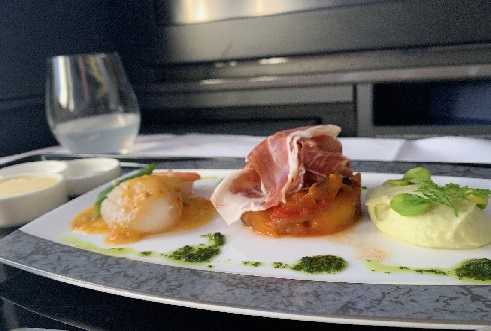
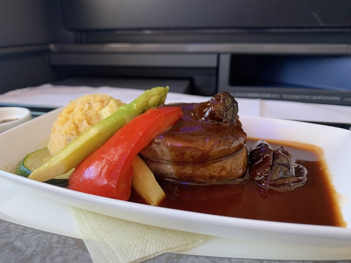
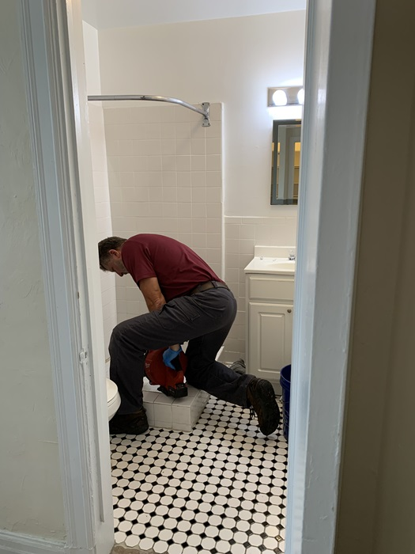
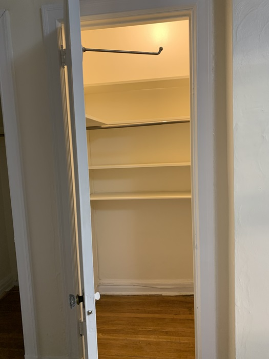

## はじめに

こんにちは！

私はカーネギーメロン大学（CMU）で研究を行っていて、渡邉先生の研究室に所属している修士の学生です。

ここでは、Pittsburghでの暮らしやアメリカでの生活でいろいろ気が付いたところについて書いていきたいなと思っています。

誰向けなのかよくわかりませんが、日記（週記?）的な感じで書いていきたいと思います。

### 日本からピッツバーグへ

フライトをビジネスクラスにアップグレードできたので、空の旅はとても快適でした。

日本の羽田空港からまずシカゴのオヘア空港に行き、そこからピッツバーグに向かいました。

飛行機が遅れて焦りましたが、CAさんから現地のスタッフに連絡してもらっていたようで、別の便をrebookしてもらえていて、無事に到着できました。

食事が特に豪華で、ステーキが出てきたり、お茶がグラスで提供されたり、やっぱりエコノミーとはレベルが違うなぁと思いました。

### ピッツバーグ到着後の移動

ピッツバーグの公共交通は基本バスです。

スマホの「transit」というアプリがあって、それで一回$2.75のチケットを買って乗ります。

スマホでQRコードを出してピッとするんですが、初めて乗ったときはこれを知らなくて迷惑かけました。

それにしても一回の料金が高い。。

CMUの学生の場合、学生証を使えばバス無料なので、学生証取得してからはバスかなり使いました。

### 新居での初印象

最初に住むアパートに入った時、なんかすごい変なにおいがしました。

痕から気が付いたんですが、たぶんすごいペンキ臭いんですよね。。

換気や掃除をしてだいぶ改善されました。

シャワーが詰まっていたり、ドアの立て付けが悪かったり、なんか鍵うまく閉まらないし、最初はトラブル続きだったけれども、管理会社に全部報告して全部直してもらいました。

中には、「消すことのできない、スイッチのない電球」というナニコレ状態のものもありました。

これは人感センサー付きの電球になっていて、根本解決になってないというものもありました。

### アメリカの食文化に適応中

最初の日は、近所のスーパーでパンとサラダを購入しましたが、パンがとてつもなくおいしくない。

本当においしくない。

$4-$5くらいの茶色の四角いパンで、薄切りにスライスされてるパンなんですが、もう二度と買わないですね。

スライスを一口かじって、ため息が出るほどおいしくないパンでした。

まぁ、これからもピッツバーグでの生活について、週１でブログ書けたらなぁと思います。

それでは、また次回
