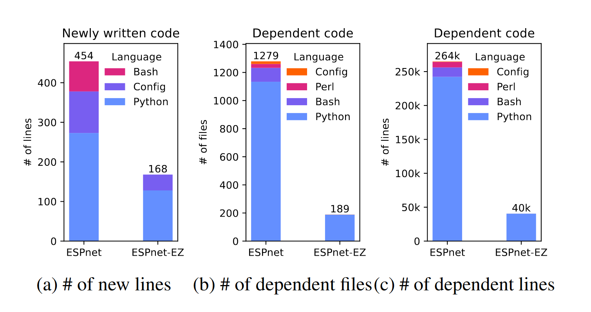
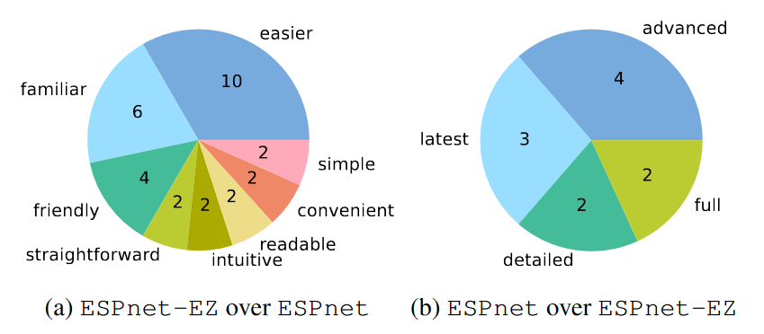
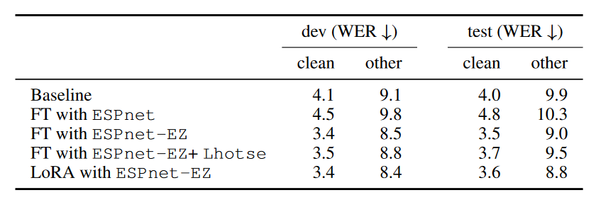

# ESPnet-EZ: Python-Only ESPnet for Easy Fine-Tuning and Integration

SLT2024で発表します。
[arXiv](https://arxiv.org/abs/2409.09506v1)

## 概要

ESPnetは実験の再現を行ったり、クラスター環境で実験を行うには非常に優れたツールですが、shell scriptの複雑さや種類の多さから、入門するための敷居がとても高いという問題がありました。
この問題に対応するため、ESPnetのレシピの多さや機能性を損なわずに、Pythonicな実装を可能にしました。
これによって、ESPnet入門の敷居がかなり下がったように感じています。（体感）

## 今までのESPnet

今までは、新しいデータセットに対応するためにはrecipeを作成する必要がありました。
recipeがあることで、だれでも同じようにdata preparationやpreprocessingができるので、実験の再現性という点において非常に大きなメリットがありました。
しかし、だからこその様々な決まり事がありました。
例えばデータの格納方法についての制約があるので、近年発展しているHuggingfaceのdatasetやLhotseといった優れたライブラリとの連携がうまくできないという問題がありました。

その他にも、膨大なshell scriptや複雑なscriptは、beginnerからすると相当とっつきにくいものだと思います。
私自身、初めてESPnetを触ったときはshell scriptに明るくなかったので苦労した覚えがあります。

## ESPnet-EZ

EZでは、ESPnetの機能をPythonのみで直感的に触れるようにしようというコンセプトで作りました。
特に、「１個１個のちょっとした実験を簡単に回せるようにしておきたい」という思いが強く、１つの実験を１つのファイルで完結するようにESPnetのラッパークラスを作成していきました。
もちろんその他のライブラリに優れたものはたくさんありますが、ESPnet-EZには以下のような強みがあります。

- Research orientedなツールなので、かなりの数のTaskをサポートしているし、これからも増え続けていく。
- 超大量のレシピや、その中で研究された設定をそのまま使って実験できる。
- （多少 shell scriptを触りますが）実際に実験で利用したdata preparationを実行して、そのうえでPythonicなファイルを書いて実験できる。

ESPnet-EZでは、従来のESPnetではできなかった外部ライブラリとの連携もスムーズにできるようになっています。
そのため、Lhotseを用いて処理したデータをESPnetのモデルで学習することもできますし、大量のデータをshardに保存しておいて、webdatasetを使って読み込んで使っていくこともできます。

また、ESPnet-EZでは、モデル定義の自由度も上げています。
yamlファイルで設定するものだけでなく、ユーザが自由にモデルを定義してTrainerに渡せるようになっています。
例えばwebdatasetを用いてAmazon S3に保存したデータをロードし、学習済みOWSMのEncoderを計算 → 出力結果をHuggingface hubの学習済みGPT-2に渡し、音声翻訳モデルを学習するというような複雑なこともできます。

この機能を付けたことで、ESPnet-EZではモデルをscratchから学習させるツールというよりは、Fine-tuning等を行うツールとしての側面が強くなりました。
従来のESPnetでは、学習済みモデルに対して何か特殊なモジュールを追加したり、処理内容に変更を加えることはできませんでしたので、大きな変更点といってもよいかもしれません。

## 比較

### コードを書く量について

新しいデータセットに対応するコードを書いて学習するのに必要な行数の比較です

### ユーザからの意見

実際に学生の方に意見を聞いてみました。
左側はESPnetに対してESPnet-EZについての意見、右側はESPnet-EZに対してESPnetの意見です。

### Fine-tuningの結果比較

ここでは、文字起こしタスク（Automatic Speech Recognition, ASR）の結果を紹介します。その他のタスクについてはpaperを参照してください。

[OWSM-v3.1-base](espnet/owsm_v3.1_ebf_base)モデルを[Librispeech-100h](https://www.openslr.org/12)データセットでFine-tuningしました。
学習データには含まれていますが、LhotseやLoRAを用いてFine-tuneすることで若干の精度向上ができました。
指標はWord Error Eate (WER) で、正解と文字起こし結果の一致率を[%]で表します。

## 裏話

CMUに入学した後、実験をたくさん回すのにshell scriptが複雑だと若干使いにくいし、laptopでデバッグのテスト実行をしたりするのも大変だなぁと思っていました。
そこで、チョチョッと書いてパッと実行できるようにしようと思って、ESPnetのラッパークラスとしてESPnet-EZを準備しました。

これは本当に単純なラッパークラスなので、正直なところ論文にするほどの新規性はないと思っていました。
ですが、Watanabe教授とKwangheeのおかげで素晴らしいpaperに仕上がりました。
特にユーザからの意見を載せようとか、コードが減った図を載せようとか、一人では思いつかなかったアイディアが実際に論文になっていく様はなかなか感動しました。

また、このプロジェクトではいろいろな方に実装を手伝ってもらったり、実験を分担したりなど、多くの方に協力してもらいました。
彼らの協力がなければここまでのものは絶対完成できなかったと思うので本当に感謝ですね。
