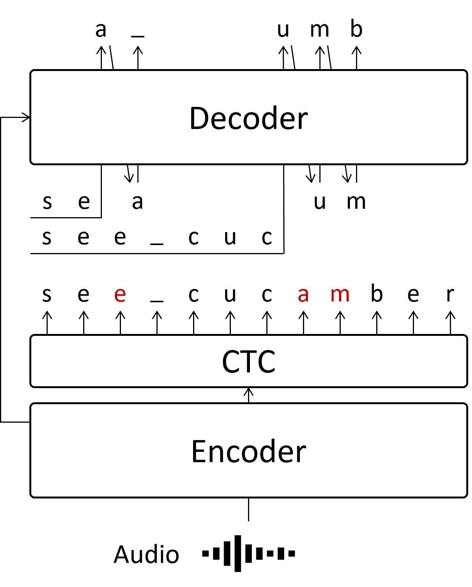

# Segment-Level Vectorized Beam Search Based on Partially Autoregressive Inference

[arXiv](https://arxiv.org/abs/2309.14922)

## 概要

Autoregressive(AR)なデコード処理と、Non-Autoregressive(NAR)なデコード処理を組み合わせることで、それぞれが持つ弱みを消しあいながら、強みを生かしあうデコード処理を実現しました。
結果として、ARな処理と比較して精度をほとんど落とすことなく、大体12-13倍の高速化に成功しました。
このデコード処理のための特殊な学習は必要なく、学習済みのCTC/AttentionなARモデルをそのまま利用できることもメリットの一つです。
ESPnetに追加済みです。→ [5760](https://github.com/espnet/espnet/pull/5769)

## 具体的な手法の説明など

### ARとは?

音声認識でメジャーなデコード処理として、前の文字列を推論してから次の文字を推論するAutoregressive(AR)な推論方法があります。

ここでは、 `sea cucumber` という文字列を推定しています。
例えば２文字目の `e` は、最初の `s` が推定されてから、「１文字目は `s` だ」という情報を使って推論を実施します。
この手法は精度が良いという反面、最後の文字については前の推論が終わるまで待たなくてはならないので、全体の推論が終わるまで時間がかかってしまいます。

### NARとは？

ARでは、全体の文字列の推論を実施するのに時間がかかるという欠点がありました。
そこで、すべての文字列を一気に推論してしまおうというのがNon-Autoregressiveな手法です。

NARには様々な手法があって、それぞれに構造が異なるのですが、ここでは本研究で参考にした[Mask-CTC](https://arxiv.org/abs/2005.08700)という手法を表示しています。
まず `CTC` というモジュールで全体の文字列を一度に推論してから、間違っていそうな箇所をDecoderで修正します。

NARはARと比較して非常に高速ですが、ARとは違って推論するtokenの位置より前の情報を使えないため、ARより精度が低く、推論ミスが発生しやすいという欠点もあります。
また、Mask-CTCの場合、最初に `CTC` で予測する文字列の長さが間違っている場合、修正で長く/短くすることはできません。
例えば、赤字の `am` 部分について、もしも正解が `m` だけだった場合、そもそも文字数が違うので、Decoderで修正しても必ず推論ミスが発生します。

### 今回提案するPARとは

そこで今回提案したのは、 `CTC` で推論した中で、間違っていそうな箇所のみARで推論するというものです。
一部だけARな手法でデコードするため、Partially Autoregressive (PAR) なデコードとしています。

それぞれの間違っていそうな箇所（赤字箇所）を並列処理することで、実質的にARの繰り返し処理の回数を大幅に減らすことができます。
赤字の推論のために、それ以前の文字列をsegmentとして並列で推論を実施します。
つまり、独立した赤字部分の数だけsegmentが作成され、AR処理を同時に実施することで高速化を図ります。

なお、２つ目以降の赤字箇所では、必ずそれ以前に赤字箇所が含まれます。（例えば、 `am` を推定する時には、一つ目の赤字 `e` があります）
これは、１つ目の赤字箇所の推論結果を待って２つ目の推論に移るべきではありますが、その場合はARと同様の推論速度に関する問題が発生してしまいます。

そこで、今回はCTCの結果が間違っていたとしても、そのまま利用することで並列処理できるようにしています。
実験では、CTCの結果をそのまま用いても精度が落ちないことがわかっています。

## 実験結果

### AR vs PAR

精度はWord Error Rate (WER, Errorの列)、推論速度はReal Time Factor (RTFの列)に記載しています。
どちらも数字が小さいほうが精度が良いことを表しています。

PARでは、ほとんど精度を落とすことなく、推論速度を高速にできていることがわかります。
なお、この高速化は並列処理によるものなので、推論する音声が短いと（ARでの繰り返し回数が少ないと）PARでの高速化効果は小さくなります。
逆に長い音声の場合はその効果は絶大で、今回の実験では最大89.7倍の高速化を確認しました。

### Trade-off

以下に精度と推論速度についての表を作成しました。
それぞれ、beam searchのパラメータである beam sizeを1から20まで変化させて精度と速度を計測しています。
(beam sizeが小さいと、精度は悪化するが早くなります。)

ARと比較すると、PARの線はLibrispeechの100hデータセット、960hデータセットのどちらで学習した場合も左に寄っていて、Trade-offが改善していることがわかります。

### NAR vs PAR

以下はLibrispeech 100hデータセットで学習/評価した結果です。

推論速度はNARに及んでいないですが、精度はNARを大きく上回っており、ARと同等レベルの精度が出ていることがわかります。

## Limitation

### 精度について

PARの部分でも記載しましたが、特に２つ目以降の赤字箇所では、AR推論に用いる「前の部分」が間違っている可能性が十分にあります。
そのため、これが影響して精度が悪化する可能性があります。

### メモリ使用量について

並列処理する関係上、一度に使うメモリ使用量は増加します。
しかしこれについては、推論時のメモリの活用方法について実装を改善することで、メモリ使用量についての問題は解決できました。
これはESPnetでの実装に際して修正済みとなっています。

## 裏話

この論文を書き始めた一番最初のころ

ESPnet-ONNXの実装をNARに広げてみようとしていた際に、Mask-CTCの詳細を実装レベルで確認していました。
この時に、なんとなく「NARとARと組み合わせれば、二つのいいとこどりができるのでは？」と思い、論文を調べ始めました。
同様の発想ならMask-CTCを引用しているだろうと思い、Mask-CTCを引用している論文のリストをすべて探しましたが、それらしいものが見当たりませんでした。

そこで、最初は試しに[GLM](https://arxiv.org/pdf/2103.10360)を参考に、Mask箇所の前後も考慮してARで推論できるモデルを学習してみました。
Libriseechのテキストで学習してみたのですが、精度がどうしても上がりませんでした。
この時は自前のRTX-2080ti１枚しかなく、１回の学習もだいぶ時間がかかっていたこともあって、大規模な計算機が使えるようになってから試せばいいやというマインドでいったんあきらめました。
（この時大学は申し込んですらいませんでしたが、どこかの大学院にはいきたいと思っていました）

しかし散歩しているうちに、ARなデコードにおいて「あるk番目のtokenを推定するのに最低限必要なものは、学習済みのモデルと、`sos`トークンと、k番目という位置情報くらいでは？」という考えに至りました。
それならば、Mask-CTCのlow-confidentな部分を推定するのに必要なものは既にそろっていて、追加の学習は一切必要ないと考えました。

そこで、Mask-CTCのlow-confidentな箇所の手前からARなデコード処理をしてみたところ、うまくいきそうだということがわかりました。
渡邉先生とはGLMあたりから少しずつ会話させていただいていましたが、このAR処理がちょっと早くなった時に、「AR処理を並列化できればいいね」というような指摘をもらっていました。
そこでARの並列化に合わせて、ESPnetではCPU処理になっていたVectorized Beam searchの処理もついでにGPUで処理できるように実装してみたところ、今回のような実験結果になりました。

IBMで働きながらの実験や執筆だったので大変ではありましたが、ESPnet-ONNXの反省を生かして実装にいろいろ仕込んでおいたことが功を奏し、締め切りに追われることなく割と快適にかけたと思っています。
ASRUの結果を受けて、今回の論文ではRelated worksの部分が圧倒的に足りないことがわかったので、次回自分が書く際はRelated worksをもっとしっかり書けるようにしたいですね。

