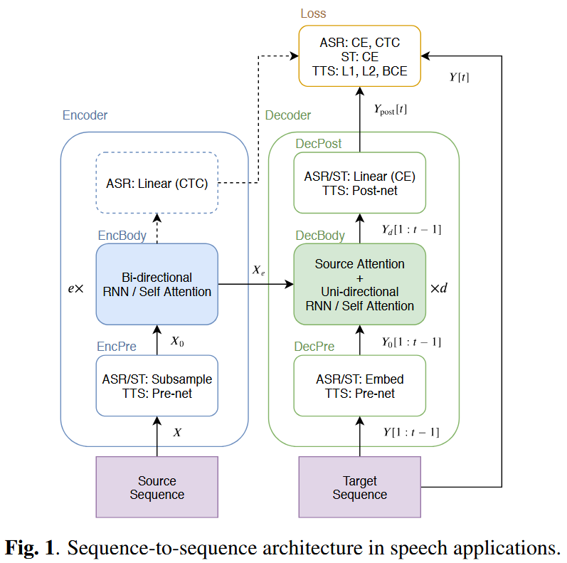
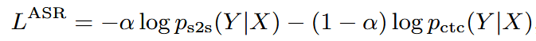
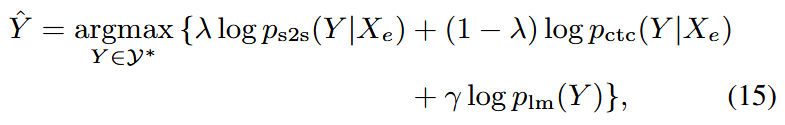
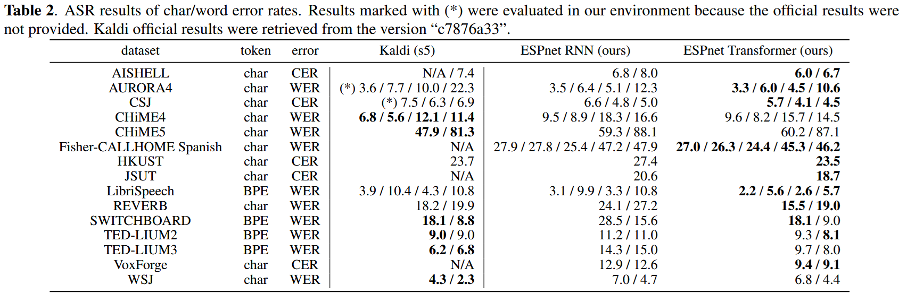
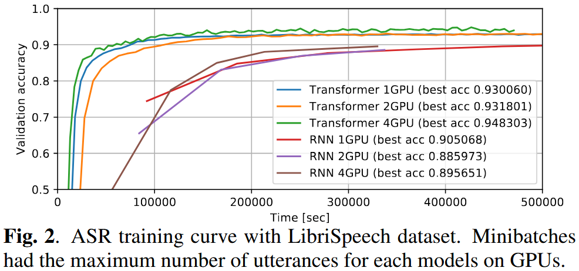
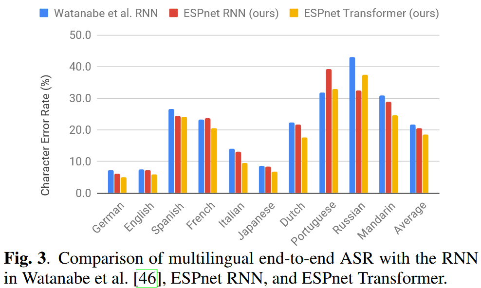
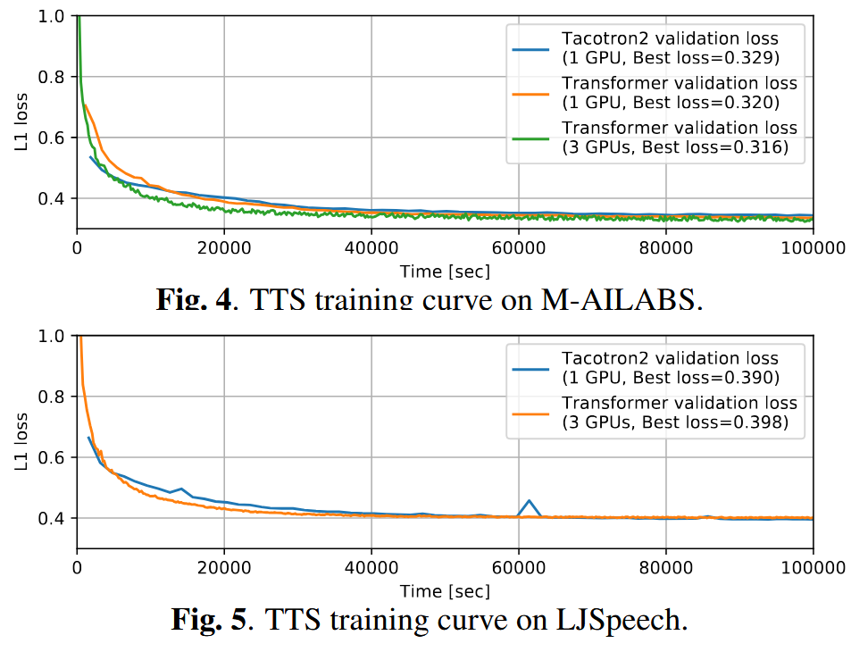
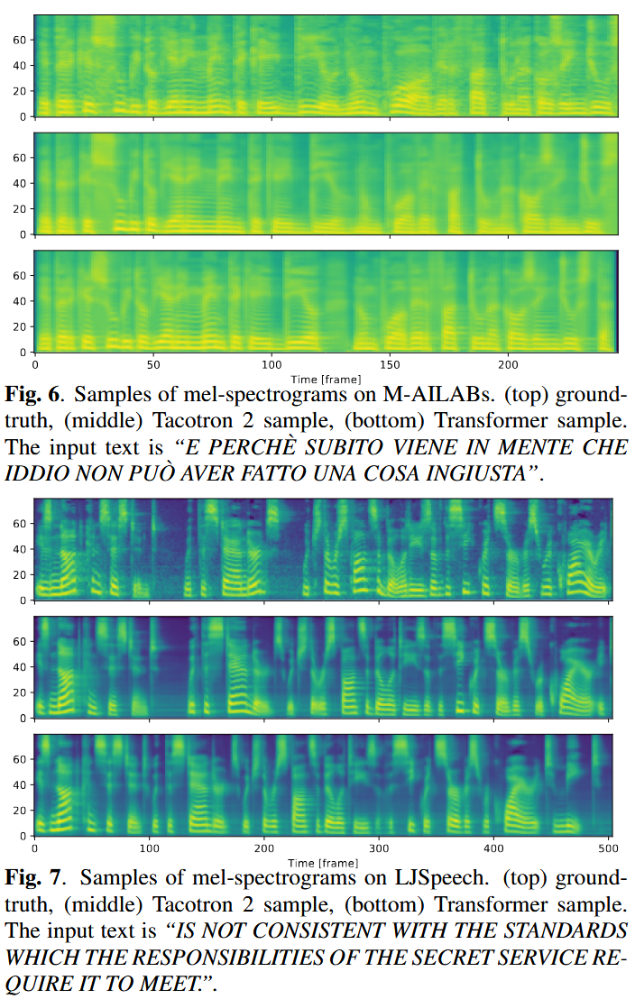

# A Comparative Study on Transformer vs RNN in Speech Applications

[arXiv](https://arxiv.org/abs/1909.06317)

## 概要

この論文では、Transformerと再帰型ニューラルネットワーク（RNN）を、音声認識（ASR）、音声翻訳（ST）、音声合成（TTS）といった幅広い音声タスクにおいて比較検討しています。驚くべきことに、ASRの15ベンチマーク中13でTransformerがRNNを上回る精度を達成し、STやTTSにおいても同等の性能を示しました。また、Transformerの学習には大規模なミニバッチやマルチGPUによる恩恵が大きいことも報告されており、実験再現性の高いレシピがESPnetに統合されています。

---

## 1. 背景と動機：なぜTransformerとRNNを比較するのか？

Transformerは自然言語処理において革新的な成果を挙げてきましたが、その計算コストの高さや学習の不安定さにより、音声分野では十分に検討されていませんでした。

一方、RNN（特にLSTM）は時間的系列を自然に扱えるため、これまでの音声処理において広く用いられてきました。

本論文では、以下を目的としています：

* ASR・ST・TTSにおいて**Transformerがどれほど精度を改善できるかの定量的評価**
* **実践的な学習のコツの共有**
* [ESPnet](https://github.com/espnet/espnet)における**再現可能なレシピの提供**

---

## 2. モデルアーキテクチャの概要

### 🔁 再帰型ニューラルネットワーク（RNN）

* **エンコーダ**：双方向LSTM（BLSTM）
* **デコーダ**：注意機構付きの単方向LSTM
* 時系列データに自然に適合するが、**逐次処理であるため並列化が困難**

### 🔀 Transformer

* 再帰構造の代わりに\*\*自己注意（self-attention）\*\*を使用
* エンコーダ・デコーダ共に**完全な並列化が可能**
* 時系列情報を補うために位置エンコーディングが必要

📝 両モデルとも、以下のようなS2S（seq-to-seq）構成を共有しています：
`EncPre → EncBody → DecPre → DecBody → DecPost`



---

## 3. 音声タスクへの適用

### 🗣️ ASR（自動音声認識）

* 入力：log-mel + ピッチ特徴量（計83次元）<a id="foot_1">\[1]</a>
* 損失関数：S2S損失とCTC損失の加重和
  
* デコーディング：S2S + CTC + RNN-LM（任意）を組み合わせ
  

---

### 🌐 ST（音声翻訳）

* 入力：ある言語の音声
* 出力：別の言語の翻訳文
* ASRと類似の構造だが、**非単調アライメントのためCTCは使用しない**

---

### 🗣️→📊 TTS（音声合成）

* 入力：テキスト列
* 出力：メルスペクトログラム + EOS確率
* 損失関数：L1損失 + バイナリ交差エントロピー（BCE）
* 学習時は**teacher-forcing**、推論時は自己回帰的に出力を生成

---

## 4. ASR：実験結果

### ✅ 15のASRベンチマークで評価

* 言語：英語、日本語、中国語、スペイン語、イタリア語
* 条件：クリーン音声、雑音下、遠距離収録、低リソース環境など
* **15タスク中13でTransformerがRNNより高精度**
* 発音辞書やアライメントなしでもKaldiを上回る精度を達成するケースも



### 🔧 学習のコツ

* Transformerは**大規模ミニバッチ**で精度が向上
* GPUが限られる場合は**勾配の蓄積**が有効
* Transformerには**Dropoutが不可欠**
* SpecAugmentや速度拡張は両モデルに有効
* デコード時の超パラメータ（CTC/LMの重み）は共通で流用可能



---

## 5. 多言語ASR

* 英語・日本語・スペイン語・中国語など、**10言語の単一モデル**で学習
* 出力：共有グラフェーム辞書（5,297トークン）
* Transformerは**言語非依存的な性能**を発揮
* 8言語で**10%以上の相対的CER改善**を達成



---

## 6. 音声翻訳（ST）

* データセット：Fisher–CallHome（英語→スペイン語）
* BLEUスコア：Transformer = 17.2、RNN = 16.5
* ASRのエンコーダを再利用して学習を安定化
* Transformerは**低リソースSTでは慎重な学習設計が必要**

---

## 7. 音声合成（TTS）

* 対象データ：M-AILABS（イタリア語）、LJSpeech（英語）
* 検証損失（L1）は両モデルでほぼ同等
* Transformerは**大規模バッチでより良く学習**
* 一部のAttentionヘッドに対してのみ**ガイド付きAttention損失**を適用




### ⚠️ Transformer-TTSの課題

* 推論速度はRNNに比べて**大幅に遅い**
* FastSpeechを使うとレイテンシが劇的に改善（0.6ms/frame vs 78ms）

---

## 8. 結論

Transformerの利点：

✅ より高い認識精度
✅ マルチGPU対応が容易
✅ ESPnetに再現可能なレシピが統合済み

ただし…

⚠️ 学習は慎重に設計する必要あり
⚠️ 特にTTSでは推論時間がネックになる可能性あり

とはいえ、本研究はTransformerを**エンドツーエンド音声タスクにおける有力なアーキテクチャ**として明確に位置付けています。

---

## 9. リソース

* GitHub: [ESPnet Toolkit](https://github.com/espnet/espnet)
* デモ音声・サンプル: [bit.ly/329gif5](https://bit.ly/329gif5)
* <span id="foot_1">\[1]</span> P. Ghahremani et al., “A pitch extraction algorithm tuned for automatic speech recognition,” ICASSP 2014.

---

## 📌 引用文献

この研究を参考にした場合は、以下の引用をお願いします：

```
@INPROCEEDINGS{9003750,
  author={Karita, Shigeki and Chen, Nanxin and Hayashi, Tomoki and Hori, Takaaki and Inaguma, Hirofumi and Jiang, Ziyan and Someki, Masao and Soplin, Nelson Enrique Yalta and Yamamoto, Ryuichi and Wang, Xiaofei and Watanabe, Shinji and Yoshimura, Takenori and Zhang, Wangyou},
  booktitle={2019 IEEE Automatic Speech Recognition and Understanding Workshop (ASRU)}, 
  title={A Comparative Study on Transformer vs RNN in Speech Applications}, 
  year={2019},
  pages={449-456},
  keywords={Decoding;Training;Task analysis;Xenon;Recurrent neural networks;Speech recognition;Transforms;Transformer;Recurrent Neural Networks;Speech Recognition;Text-to-Speech;Speech Translation},
  doi={10.1109/ASRU46091.2019.9003750}
}
```

## おまけ

なんだかASRUの論文の中で一番引用されている論文のようで、正直このプロジェクトに入れてもらえたのはラッキーだったなと思っています。
これは私が初めて参加した大規模なプロジェクトで、日本語用のTransformerモデルを学習して結果を載せていました。
また、warmup stepsの設定によって結構最終的な精度がわりと変わるのも気が付いて、チームに連携したりしていました。
意外とちょっとしたことで精度変わるもんなんだなぁと。

Watanabe先生の授業ではよくこの論文が紹介されていて、たまに「実は生徒の一人がco-authorに居たりします」という話題になって、一瞬「えっ」となるのがなかなか嬉しいです。
正直当時はわかっていませんでしたがAuthorがみんなすごい方ばかりで、私一人Undergradだったけどよくやったなぁと

