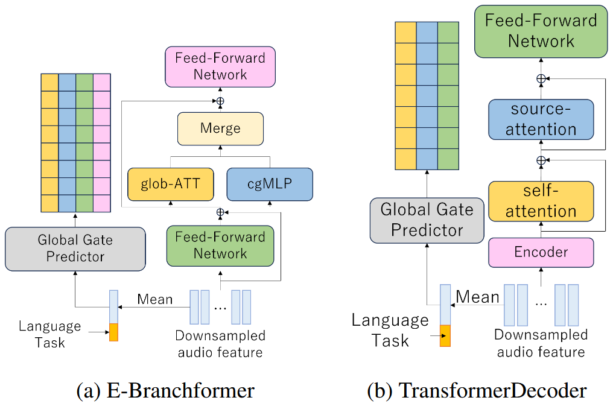
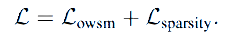
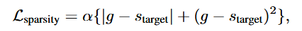
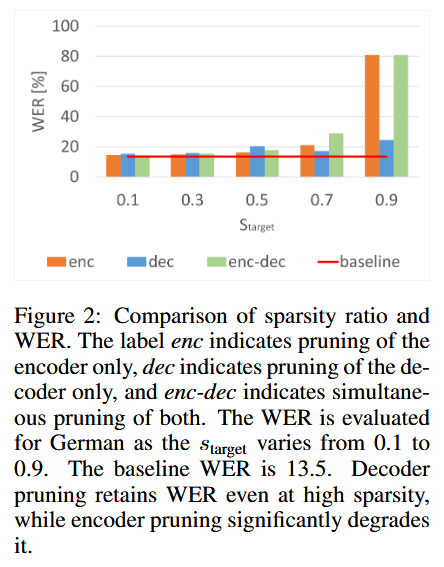
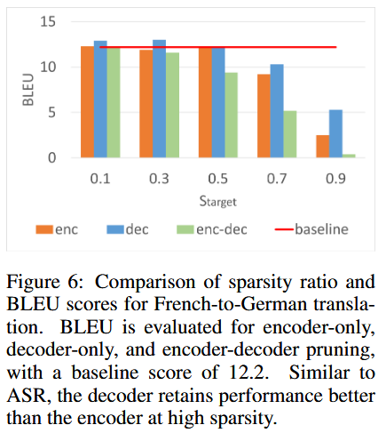
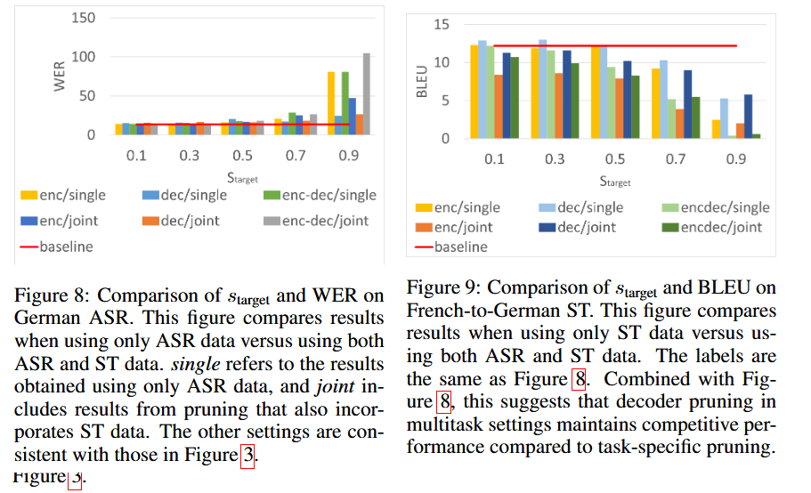
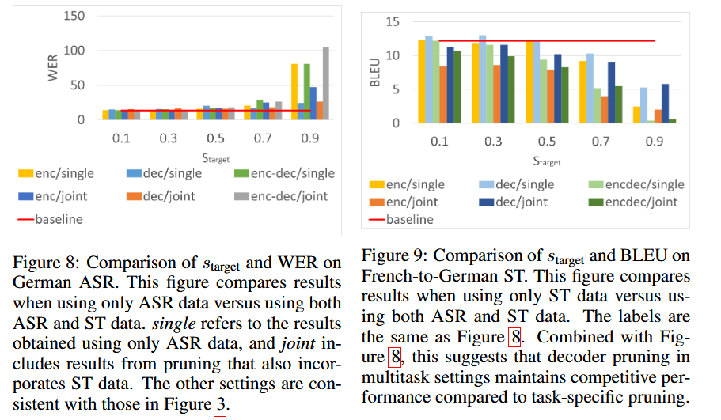
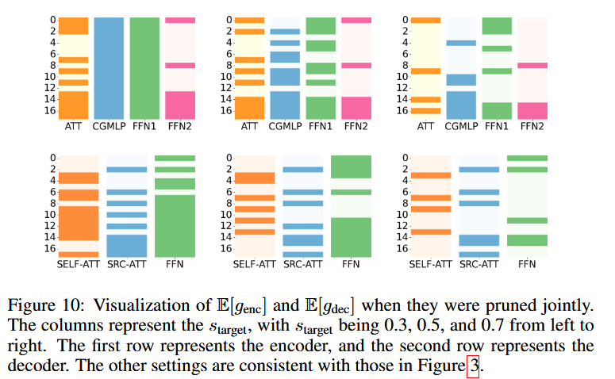
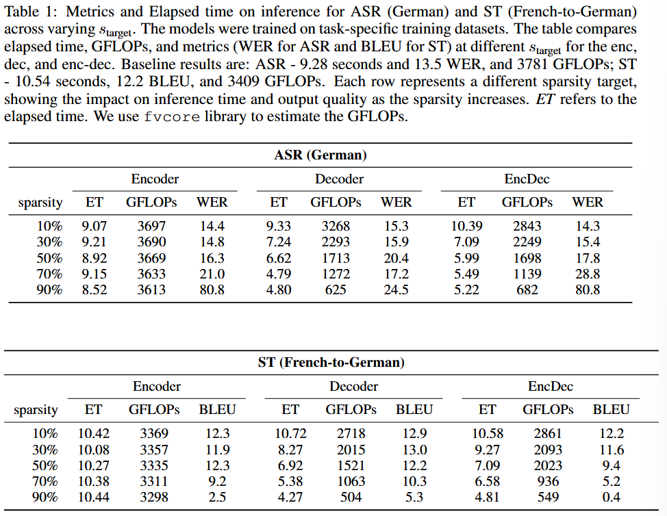

# Context-Aware Dynamic Pruning for Speech Foundation Models

[arXiv](https://arxiv.org/abs/2409.09506v1)

## Abstract

This study proposes a **context-aware dynamic pruning method** for multilingual and multitask speech foundation models. The method achieves **up to 30% reduction in inference cost** while maintaining model accuracy. Unlike conventional pruning, which is fixed during training, our method enables **flexible module-level pruning** based on contextual cues such as language, speaker, and task during inference.

---

## 1. Motivation: Why Dynamic Pruning?

* Conventional LLMs and speech models are massive, making **inference cost a real-world bottleneck**.
* Speech tasks involve long temporal sequences, with **heavy computational burden on the decoder**.
* However, **not all modules are needed all the time**.

We hypothesize that:

* The required model structure **varies across tasks and languages**.
* Therefore, we propose **dynamic pruning that adapts the model structure to the context**.

---

## 2. Architecture Overview

### 🧠 Base Model: Open Whisper-Style Speech Models (OWSM v3.1)

* **Encoder**: E-Branchformer (Self-Attention + cgMLP)
* **Decoder**: TransformerDecoder
* Contextual embeddings (language/task) are added to the input

🧩 Pruning targets:

* Encoder: FFN1, glob-ATT, cgMLP, FFN2  
* Decoder: Self-ATT, Src-ATT, FFN



---

## 3. Proposed Method: Context-Aware Dynamic Pruning

### 🎛️ Gate Control for Each Module

* A binary mask is learned for each module and each layer to decide **whether to use it or skip it**
* Gumbel-Softmax with SGSE is used for **binary decision with gradient propagation**

📐 Loss = task loss + sparsity penalty  


We included a squared term in the sparsity penalty.  
Simply minimizing the absolute difference wasn't enough to enforce the target sparsity,  
but the squared term worked significantly better in practice.



Here, `alpha` is a constant, `s_target` is the target sparsity, and `g` is the average sparsity across encoder/decoder.

---

## 4. Experiments

### 📊 Dataset

* Europarl-ST (German, French, Italian – approx. 20 hours each)
* Tasks: ASR (Automatic Speech Recognition), ST (Speech Translation)

### 🧪 Experimental Settings

* Sparsity target: 10% to 90%
* Evaluation done separately on encoder / decoder / both
* Metrics: ASR = WER, ST = BLEU

---

## 5. ASR Results

* With high sparsity (≥70%), **pruning the encoder significantly degrades accuracy**
* In particular, **cgMLP proves critical** — pruning it increases WER
* On the other hand, **decoder pruning has little impact even at high sparsity**



---

## 6. ST Results

* In ST, **FFN and Self-Attention in the decoder are essential**
* Encoder shows similar trends as in ASR, with cgMLP remaining important
* Compared to ASR, **the decoder structure is more critical in ST**
* We observed that source attention tends to activate toward the end of decoding, both in ASR and ST, especially when only the decoder is pruned.

  


---

## 7. Multi-task Joint Training

* ASR and ST are trained **jointly in a single model**
* At inference time, **pruning the decoder is more effective than pruning the encoder**

  


---

## 8. Inference Efficiency

### ⏱️ Speed vs. Accuracy

With 50% pruning on the decoder side:

* ASR: 28.6% reduction in inference time, with only 2.8% WER increase  
* ST: 34.3% reduction in inference time, **no BLEU degradation**



---

## 9. Conclusion

✅ Dynamic model structures can adapt based on task and language  
✅ Pruning enables **significant speedup** without sacrificing accuracy  
⚠️ **cgMLP (local context)** and **decoder modules** are especially critical depending on the task

🔧 Reproducible recipes are provided using ESPnet + HuggingFace

---

## 10. Citation

```
@inproceedings{
someki2025contextaware,
title={Context-aware Dynamic Pruning for Speech Foundation Models},
author={Masao Someki and Yifan Peng and Siddhant Arora and Markus M{\"u}ller and Athanasios Mouchtaris and Grant Strimel and Jing Liu and Shinji Watanabe},
booktitle={The Thirteenth International Conference on Learning Representations},
year={2025},
url={https://openreview.net/forum?id=u2QdCiOgwA}
}
```
