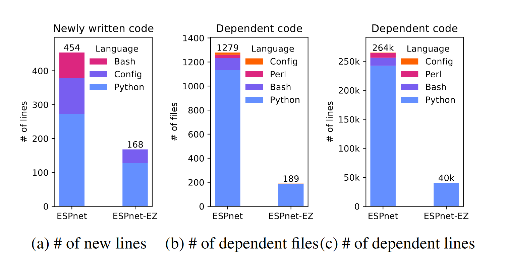
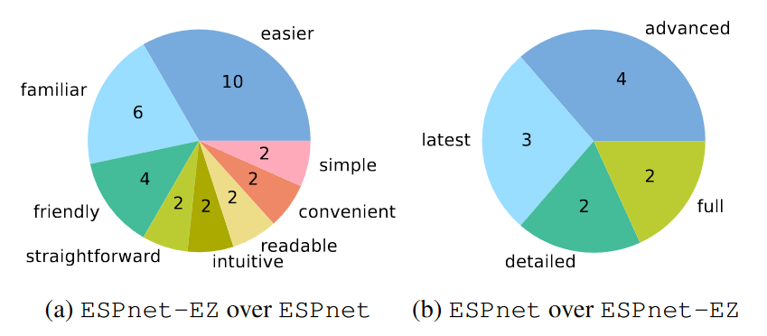
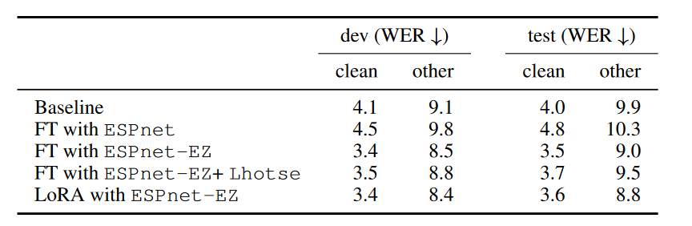

# ESPnet-EZ: Python-Only ESPnet for Easy Fine-Tuning and Integration

[arXiv](https://arxiv.org/abs/2409.09506v1)

## Overview

ESPnet is a powerful toolkit for reproducible experiments and large-scale training on clusters. However, its reliance on complex shell scripts and a wide range of pre-defined recipes has made it difficult for newcomers to get started.

To address this, we developed a more Pythonic interface to ESPnet—**ESPnet-EZ**—that maintains ESPnet's functionality and recipe coverage while significantly lowering the barrier to entry (at least from my experience).

---

## Traditional ESPnet

Previously, using a new dataset with ESPnet typically required writing a dedicated recipe. This recipe system has great benefits for reproducibility—ensuring data preparation and preprocessing are consistent—but it also introduces strict conventions and limitations.

For example, dataset structure constraints make it difficult to work with modern libraries like Huggingface’s `datasets` or `Lhotse`. On top of that, the sheer number of shell scripts and their complexity can be intimidating, especially for beginners.

Personally, I struggled a lot when I first started using ESPnet, as I wasn’t very familiar with shell scripting.

---

## What is ESPnet-EZ?

**ESPnet-EZ** is built around the idea of interacting with ESPnet **intuitively via pure Python**, especially for quickly running small experiments. The goal was to allow users to encapsulate an entire experiment in a single Python file using simplified wrapper classes.

There are many great libraries out there, but ESPnet-EZ offers some key advantages:

* It's **research-oriented**, supporting a wide variety of tasks—and that number keeps growing.
* You can reuse **existing recipes and hyperparameters** from past studies.
* While minimal shell script use remains (e.g., data prep), you can run actual experiments from Python directly, after preparing the data.

ESPnet-EZ also supports **seamless integration with external libraries**. For instance, you can:

* Train ESPnet models on data prepared with `Lhotse`.
* Use large-scale sharded datasets with `webdataset`.

---

## More Flexible Model Definitions

ESPnet-EZ increases flexibility in model definition. Instead of relying solely on YAML config files, users can now define their models directly in Python and pass them to the Trainer.

For example, it's possible to:

* Load data stored on Amazon S3 via `webdataset`
* Run inference through a pre-trained OWSM encoder
* Feed the output into a Huggingface GPT-2 model
* Train an end-to-end speech translation model using this hybrid architecture

This makes ESPnet-EZ less of a tool for training models from scratch and more of a platform for **custom fine-tuning workflows**—especially when working with pre-trained models and modifying specific components.

In traditional ESPnet, it was difficult to modify internals like the encoder or decoder once the model was defined. ESPnet-EZ overcomes this limitation.

---

## Comparisons

### Lines of Code

Comparison of code required to prepare a new dataset and train a model:

---

### User Feedback

We collected feedback from students who used both ESPnet and ESPnet-EZ. The left chart shows how ESPnet-EZ improved their experience with ESPnet; the right chart shows the reverse.

---

### Fine-Tuning Performance

Below is an example result for **automatic speech recognition (ASR)**. See the full paper for other tasks.

We fine-tuned the [OWSM-v3.1-base](espnet/owsm_v3.1_ebf_base) model on the [Librispeech-100h](https://www.openslr.org/12) dataset. While this dataset overlaps with the original pretraining corpus, fine-tuning with `Lhotse` and `LoRA` still yielded noticeable WER improvements.

Evaluation metric: **Word Error Rate (WER)** — lower is better.

