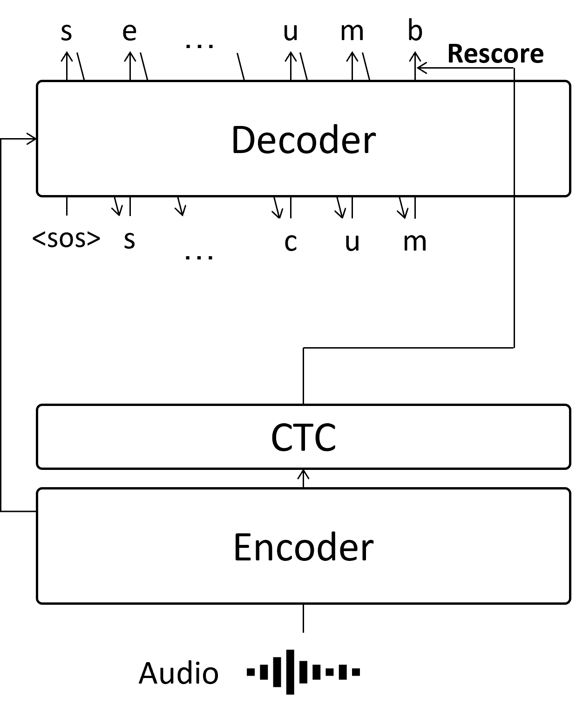
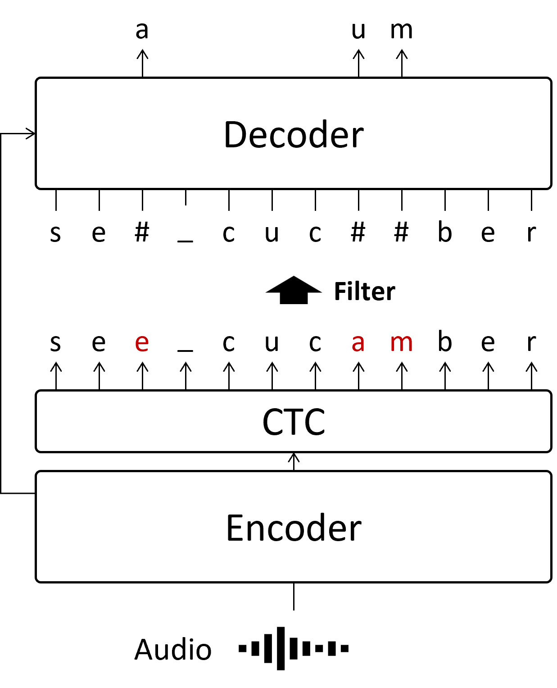
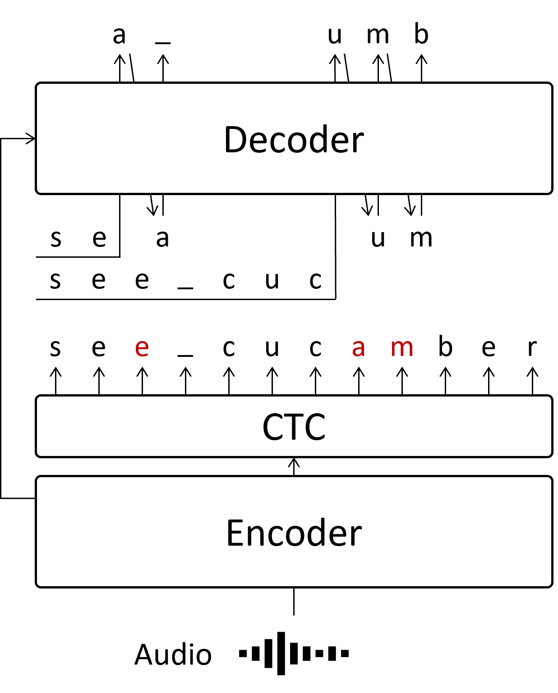
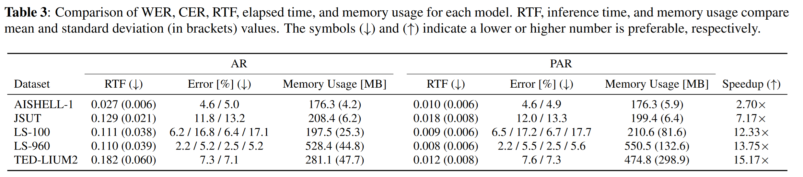
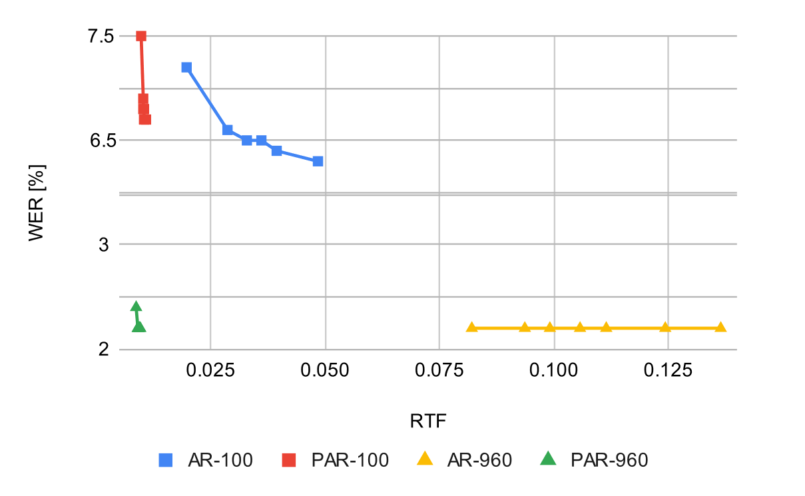
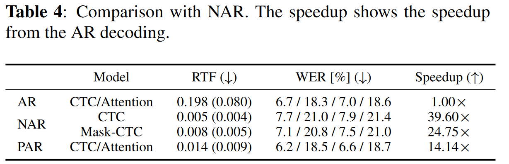

# Segment-Level Vectorized Beam Search Based on Partially Autoregressive Inference

[arXiv](https://arxiv.org/abs/2309.14922)

## Abstract

By combining autoregressive (AR) and non-autoregressive (NAR) decoding, we developed a partially autoregressive (PAR) approach that leverages the strengths of both methods. This resulted in a 12-13x speedup with minimal accuracy degradation. A key advantage of PAR is that it doesn’t require training a new model; we can achieve this speedup using a pre-trained AR model. I've integrated this decoding algorithm into ESPnet: #[5769](https://github.com/espnet/espnet/pull/5769)

## Details on PAR

### What is Autoregressive decoding?

Autoregressive (AR) decoding is a common approach in speech-to-text tasks, where each token is predicted sequentially based on the previous output.

In the example above, we estimate the string sea_cucumber. For instance, we predict the second e only after predicting the first s, utilizing the information that the first letter of this audio is s. This method yields high accuracy but is slow because each token must wait for the previous ones to be computed.

### What is Non-Autoregressive decoding?

The main drawback of AR decoding is its slow inference speed. To address this, Non-Autoregressive (NAR) decoding attempts to predict all tokens simultaneously.

There are several architectures for NAR decoding. In my work, I chose to use Mask-CTC, one of the simpler NAR structures. Initially, the CTC module serves as a NAR estimator, predicting all characters at once. Since CTC predicts tokens for each frame independently, it qualifies as non-autoregressive decoding. However, this lack of dependency across frames leads to lower accuracy compared to AR. To improve this, Mask-CTC replaces low-confidence tokens with a decoder trained on a Masked Language Model task.

This process is faster than AR because it allows parallel prediction of characters, but it comes at the cost of some accuracy loss. For example, token length cannot be adjusted even if the CTC output is longer or shorter than the actual string sequence.

### What is Partially Autoregressive decoding we propose

In our paper, we propose revising the low-confidence tokens from the CTC module using AR. This means that only part of the sequence is predicted in an AR manner, reducing the number of iterations required for AR processing. This is why we call it Partially Autoregressive (PAR) decoding.

By revising the low-confidence tokens (marked in red) in parallel, the number of AR iterations can be significantly reduced. When revising the second or later parts, each segment for the AR process contains these low-confidence tokens. While we could wait for the first part to be predicted, doing so would slow down inference. Therefore, in our paper, we utilized the CTC output even if it might contain incorrect tokens. Our experiments showed no significant difference in accuracy when directly employing the CTC output.

We computed the low-confidence tokens in parallel, reducing the number of AR iterations to the same as if there were only a single low-confidence token in the sequence. This parallelization of the AR process is the core technique that enables the fast and accurate inference presented in our paper.

## Experimental Result

### AR vs PAR

For evaluating error, we used the Word Error Rate (WER).

The results show that PAR significantly speeds up inference without sacrificing much accuracy. While the effect is less pronounced with short audio, longer audio benefits greatly, with up to 89.7x speedup.

### Trade-off

Here is a comparison of accuracy versus inference speed, measured by gradually changing the beam size from 1 to 20.

Compared to AR, the PAR line is positioned to the left on both the Librispeech-100h and Librispeech-960h datasets, indicating an improved trade-off between speed and accuracy.

### NAR vs PAR

Below are the results for the model trained and evaluated on the Librispeech-100h dataset.

The results show that PAR is competitive with NAR in terms of inference speed while maintaining accuracy at the same level as AR.

## Limitation

### Accuracy

As mentioned in the PAR section, tokens within the second or later segments can be incorrect, which may negatively impact accuracy.

### About the memory usage

Due to parallelization, memory usage increases. However, while refactoring the experimental code for the PR, I discovered that the memory issue was actually caused by the source-attention process, where the attention between the encoder output and decoder input was computed for each batch, unnecessarily copying the encoder output for each of the batches, thereby increasing memory usage. By removing this redundant tensor copy, the memory issue was resolved, and inference was further improved.